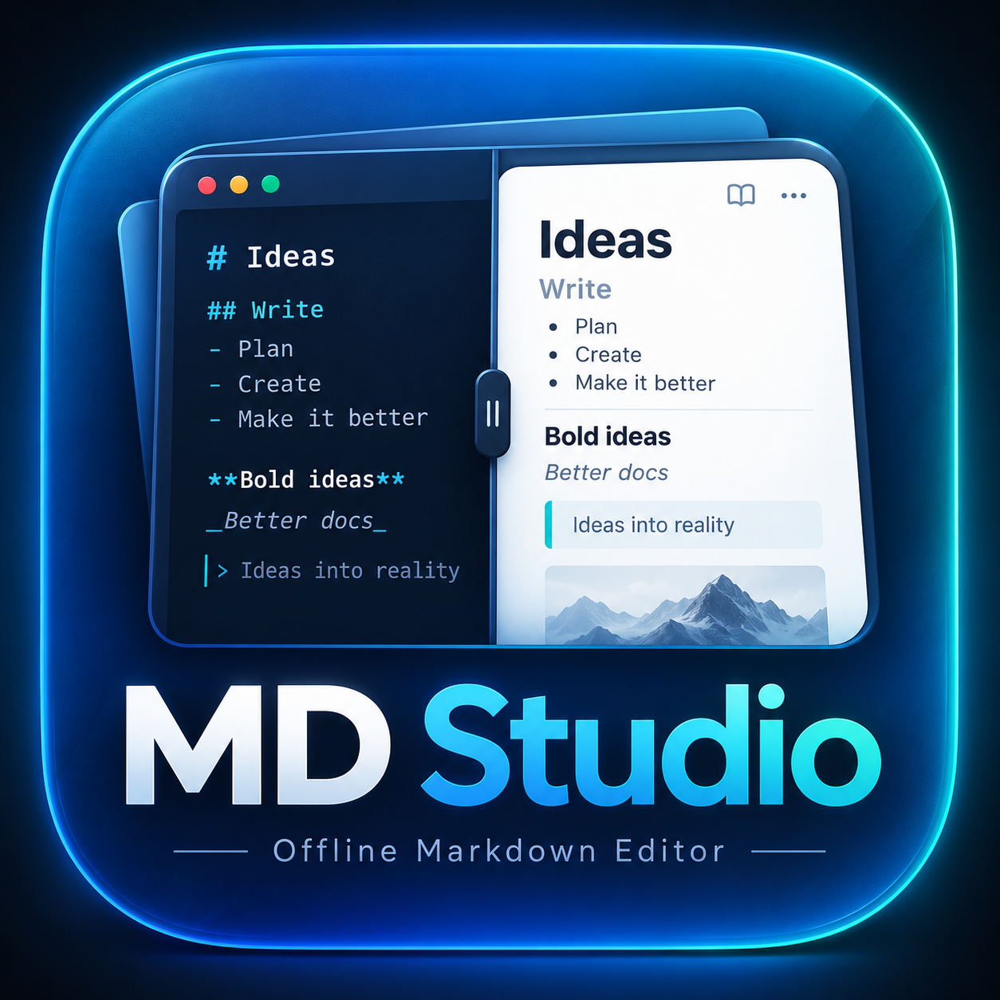
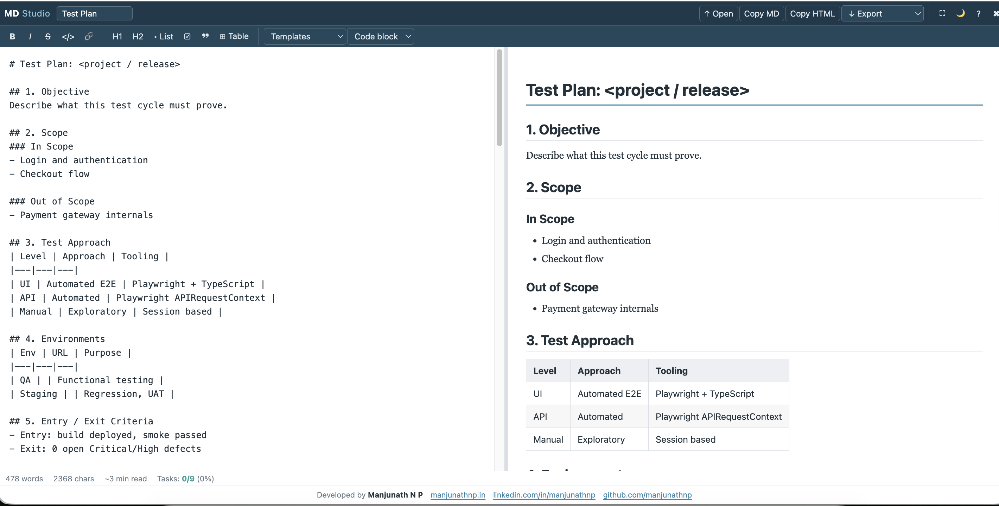

<p align="center">
  
</p>

# MD-Studio v1.0.0

An offline Markdown editor with live preview, formatting tools, and ready-to-use testing templates. Open one HTML file in your browser—no installation or build step required.



*MD-Studio’s side-by-side workspace: write Markdown on the left and see the formatted preview on the right.*

## Get started

1. Download [MD-Studio-v1.0.0.html](MD-Studio-v1.0.0.html).
2. Open it in a modern desktop browser.
3. Type Markdown, open a `.md`, `.markdown`, or `.txt` file, or choose a template.
4. Export your work to keep a separate copy.

The HTML embeds its logo, favicon, styles, and scripts. Downloading the HTML alone is enough; no assets folder is required. The repository’s `assets` folder supplies the README images only. Remote images or links in your Markdown may still require internet access.

## Features

- Side-by-side editor and live preview with a draggable divider.
- Headings, emphasis, lists, tasks, quotes, tables, links, images, and fenced code blocks.
- Bug Report, Test Case, Test Plan, Regression Checklist, and API Test Notes templates.
- Markdown and rendered HTML clipboard actions.
- Markdown, HTML, Word-compatible `.doc`, and PDF export through the browser print dialog.
- Light and dark themes, fullscreen preview, a Markdown cheat sheet, and document statistics.
- Browser-local draft autosave.

## Shortcuts

| Shortcut | Action |
|---|---|
| Ctrl/Cmd+B | Bold |
| Ctrl/Cmd+I | Italic |
| Ctrl/Cmd+K | Link |
| Tab | Insert two spaces |
| Esc, then Tab | Move focus out of the editor |
| Esc | Close an open panel or exit fullscreen preview |

## Files

```text
MD-Studio/
├── MD-Studio-v1.0.0.html
├── README.md
└── assets/
    ├── logo.png
    └── screenshot.png
```

## Developed by

**Manjunath N P**

[manjunathnp.in](https://manjunathnp.in) · [LinkedIn](https://linkedin.com/in/manjunathnp) · [GitHub](https://github.com/manjunathnp)

## License

MD-Studio identifies its application source as MIT licensed. The included third-party libraries and brand marks retain their respective licences and rights.
